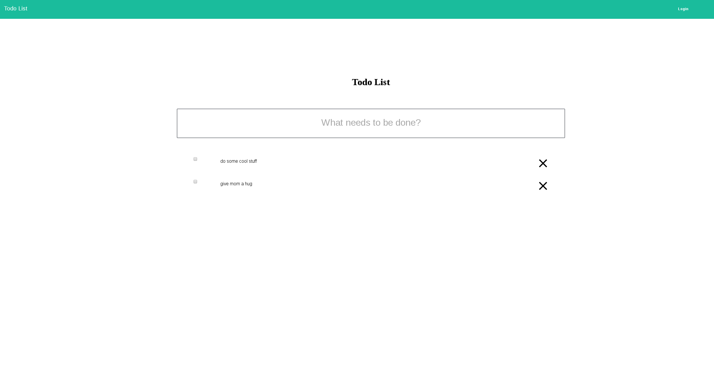

# angular2-training-app

Simple Angular 2 todo application used for training new Angular developers


# usage

```
git clone https://github.com/jonathankentstevens/angular2-training-app.git
npm install
ng serve
```




# assignment 1
- Apply material styling to the app
   - https://material.angular.io/

# assignment 2
- When checkbox is clicked, apply a class that grays out that text and remove svg and applies a strikethrough line to show the task has been completed
- Implement a progress counter somewhere that shows the number completed and the number left (ex. 3/5)

# assignment 3
- Add register button to the navbar, then add register component with page and functionality
- When a user registers, just store them in a users array (which should live in a user service)
   - You will also need to implement a user object (shared/user.ts)
- Make sure to change the Login button to Logout and hide the Register button when a user successfully logs in
